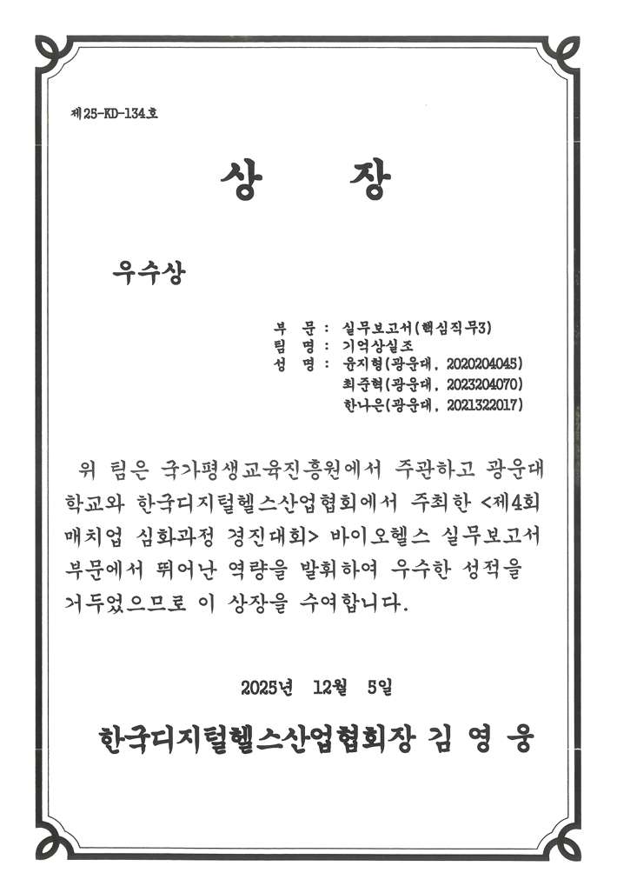

# 🫀 Heart Disease Risk Prediction & Interpretation Service

설문 기반 건강 데이터를 활용하여 통계적으로 요인을 분석하고 심장질환 위험을 예측하며, 위험 확률 제공 및 해석 가능성을 함께 고려한  
**로지스틱 회귀 기반 예측 서비스 프로젝트**입니다.

단순히 “맞추는 모델”이 아니라  
**확률을 신뢰할 수 있고, 왜 그렇게 예측했는지 설명 가능한 모델**을 목표로 설계했습니다.

---

## 수상


- 실무 보고서 부문 우수상
- 포스터&발표 부문 장려상

[서비스 프로토타입 영상](https://youtu.be/sZcmvd6OR5o?si=iKKHD6aZW_lZURqL)

## 📌 프로젝트 개요

심장질환은 조기 발견과 예방이 중요한 대표적인 만성질환입니다.  
본 프로젝트는 BMI, 생활습관, 기저질환, 주관적 건강 상태 등의 설문 정보를 기반으로 심장질환 요인을위험도를 예측하고, 이를 서비스 형태로 제공합니다.

특히 다음 3가지를 동시에 달성하는 것을 목표로 했습니다.
- ✔ 통계적 요인 분석 (analysis)
- ✔ 성능 (Prediction Performance)
- ✔ 해석 가능성 (Interpretability)
- ✔ 확률 신뢰도 (Calibration)

---

## 📊 데이터셋

- Kaggle: https://www.kaggle.com/datasets/luyezhang/heart-2020-cleaned
- CDC BRFSS 기반 설문 데이터
- 약 32만 건의 대규모 데이터
- Target: `HeartDisease (Yes / No)`

👉 특징  
- 의료 장비 데이터가 아닌 **설문 기반 데이터**
- 실제 서비스(문진형 AI)로 확장 가능

---

## 📦 변수 구성 

### 🔹 생활습관
- Smoking
- AlcoholDrinking
- PhysicalActivity

### 🔹 기저질환
- Stroke
- Asthma
- KidneyDisease
- SkinCancer
- Diabetic

### 🔹 건강 상태
- BMI
- PhysicalHealth
- MentalHealth
- DiffWalking
- SleepTime

### 🔹 인구통계
- AgeCategory
- Sex
- Race

### 🔹 주관적 건강 평가
- GenHealth

---

## ⚙️ 데이터 전처리

본 프로젝트는 실제 서비스 적용을 고려하여 **단순하면서 해석 가능한 전처리**를 적용했습니다.

### ✔ 이진 변수 변환
- Yes → 1
- No → 0

### ✔ Diabetic 재정의
- borderline / pregnancy 포함 → Yes / No로 통합

### ✔ 성별 인코딩
- Female → 0
- Male → 1

### ✔ 순서형 변수 처리
- AgeCategory → ordinal encoding
- GenHealth → ordinal encoding

### ✔ Race 처리
- One-hot encoding
- 기준 범주(White) 제거 → 다중공선성 방지

### ✔ 변수 제거
- PhysicalActivity 제거 (회귀계수 기준 유의하지 않음)

---

## 🧠 모델 설계

본 프로젝트는 목적에 따라 모델을 **3가지로 분리**했습니다.

---

### 1️⃣ Performance Model (성능 모델)

👉 목적: **예측 정확도 및 2종오류 방지 성능 확보**

- 로지스틱 회귀 기반
- 클래스 불균형 처리
- 스케일링 적용
- f1기반 Threshold 최적화 (Recall 0.7이상 보장)

#### 📈 성능

- Threshold: 0.57  
- Accuracy: 0.7890  
- Precision: 0.2559  
- Recall: 0.6986  
- F1 Score: 0.3745  
- ROC-AUC: 0.8326  
- PR-AUC: 0.3477  

👉 전략  
- False Negative 최소화 (환자 놓치지 않기)
- f1 score 중심 threshold tuning

---

### 2️⃣ Interpretation Model (해석 모델)

👉 목적: **설명 가능한 모델**

- 스케일링 제거 (계수 해석 유지)
- 로지스틱 회귀 계수 기반 분석
- Odds Ratio 활용

👉 특징  
- 어떤 변수가 위험도를 증가시키는지 설명 가능
- 사용자 입력 기반 **기여도 분석 가능**

---

### 3️⃣ Calibration Model (확률 보정 모델)

👉 목적: **확률을 실제 위험도로 변환**

- sigmoid calibration 적용
- 모델 확률 → 실제 발생 확률로 보정

👉 중요성  
- “0.4 확률”이 실제로도 발병률 40% 의미를 갖도록 보정
- 확률을 활용한 설명에서 핵심 역할

---

## 🚀 서비스 구현 (Streamlit)

사용자가 설문 형태로 데이터를 입력하면:

- ✔ 심장질환 위험 여부
- ✔ 예측 확률
- ✔ 위험도 수준 (Low / Medium / High)
- ✔ 주요 위험 요인 설명

을 제공합니다.

---

## 📁 프로젝트 구조

```
C:.
│  final_models.pkl
│  heart_eda.ipynb
│  heart_modeling.ipynb
│  heart_preprocessing.ipynb
│  README.md
│  streamlit_app.py
│  utils.py
│
├─dataset
│  │  heart_preprocessed.csv
│  │
│  └─heart_2020_cleaned
│          heart_2020_cleaned.csv

```

### 파일 설명
heart_preprocessing.ipynb
데이터 정제, 인코딩, 변수 변환, 최종 입력 데이터 생성
heart_eda.ipynb
EDA, 시각화, 통계 검정
heart_modeling.ipynb
성능 모델 / 해석 모델 / 캘리브레이션 모델 구축 및 평가
streamlit_app.py
Streamlit 기반 예측 서비스 실행 파일
utils.py
성능측정 보조 함수
final_models.pkl
최종 학습 모델 및 관련 객체 저장 파일
dataset/heart_preprocessed.csv
전처리 완료 데이터
dataset/heart_2020_cleaned/heart_2020_cleaned.csv
원본 데이터셋

## 실행방법
```
streamlit run streamlit_app.py
```
